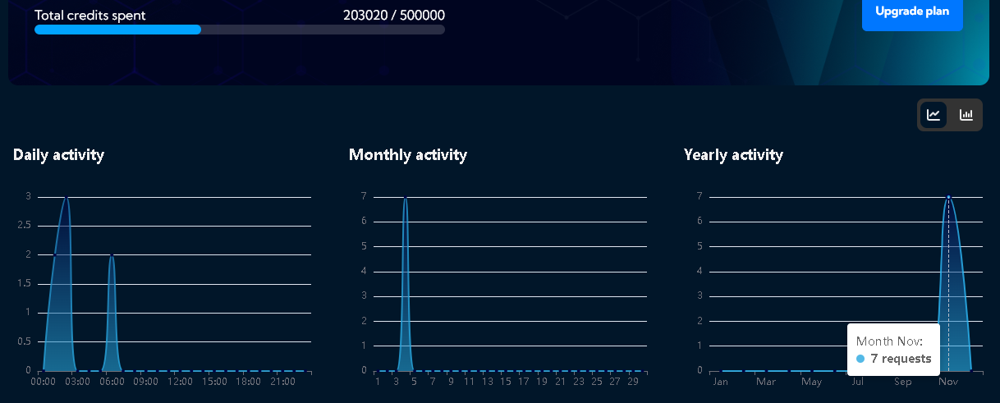

# MetaChain

**Pixel by pixel, data by data, your image is unique.**

**MetaChain is an innovative platform that leverages blockchain technology to ensure the authenticity of any digital image.** By tokenizing image metadata, we provide irrefutable proof of origin and ownership, protecting content creators, businesses, and individuals from counterfeiting and ensuring the integrity of their digital assets.

**To simplify the understanding of complex image metadata, we've integrated an AI-powered assistant.** This tool helps users easily comprehend the information stored within each image, making the verification process more accessible and efficient.

## Demo

1. [Demo - Video URL](https://drive.google.com/file/d/19dC1lU7JC-a9RY5__MoIwoBJP2y4At3-/view?usp=sharing)
2. [Demo - Website URL](https://metachain-umber.vercel.app/)

## Localhost setup

### Instructions to initialize the project and test it.

**Note:** The contract only is deployed in Arbitrum One Sepolia.

1. `git clone <repo-url>`
2. `npm install`
3. Create a `.env` file with the following variables:
   1. `OPENAI_API_KEY`: Your Open AI API key for the assistant.
   2. `NEXT_PUBLIC_THIRDWEB_CLIENT_ID`: Your Thirdweb client ID for the wallet connection.
   3. `NEXT_PUBLIC_VOTTUN_API_KEY`: Your Vottun API key for the JSON creation and token mint.
   4. `NEXT_PUBLIC_VOTTUN_PROJECT_ID`: Your Vottun project ID for the JSON creation and token mint.
4. `npm run dev`

## Use cases

### Use Case 1: Verifying the Authenticity of a Digital Artwork

**Description:** A digital art collector wants to verify the authenticity of an NFT artwork they have purchased.

**Flow:**
* The collector connects their digital wallet to the MetaChain platform.
* They enter the unique ID of the NFT they want to verify.
* MetaChain queries its database and presents a detailed report on the artwork, including transaction history, original creator, and any modifications made.

### Use Case 2: Tracking the Lifecycle of an Image in the Media

**Description:** A journalist needs to track the usage of an image they have taken to ensure it is properly attributed and not used without authorization.

**Flow:**
* The journalist tokenizes the metadata of their image on MetaChain.
* Each time the image is shared or used in another medium, a new transaction is recorded on the blockchain.
* The journalist can consult the usage history of their image at any time, including who has used it and where.

### Use Case 3: Copyright Management for Professional Photographers

**Description:** A professional photographer wants to protect their copyrights and monetize their images more efficiently.

**Flow:**
* The photographer tokenizes the metadata of all their images on MetaChain.
* When selling a usage license for an image, they generate an NFT representing that license and register it on the blockchain.
* License buyers can verify the authenticity of the license and the usage history of the image at any time.

## Why did our team adopt the approaches we did?

**We chose to develop MetaChain as a web application accessible from any internet-connected device.** This allowed us to create an intuitive and user-friendly platform without requiring any additional software installations.

**Why a website?** Because virtually everyone in the world has access to the internet through a device, be it a smartphone, tablet, or computer. Additionally, the ability to take photos and digitally edit images is increasingly common.

**The core of MetaChain lies in image metadata.** This unique and immutable data contains crucial information about the image, such as creation date, device used, and modifications made. By storing this metadata on a blockchain like Arbitrum One, we ensure its immutability and transparency. We selected Arbitrum One for its speed and low transaction costs, facilitating large-scale adoption of our platform.

**To simplify the interaction with metadata, we've integrated a virtual assistant powered by the GPT-4-mini model.** This assistant, thanks to its natural language processing capabilities, can help users easily and quickly understand the information contained within an image's metadata.

**Lastly, we utilize the Vottun platform to streamline the technical process.** Vottun allows us to effortlessly create JSON files and mint NFTs, significantly reducing the time and effort required for these tasks. Moreover, it provides an intuitive interface for monitoring and managing our NFTs.

**In summary, MetaChain offers a simple and secure solution for verifying the authenticity of digital images.** By combining the power of blockchain, artificial intelligence, and an intuitive interface, we've created a platform that facilitates the protection of intellectual property and the fight against counterfeiting.

## Our experience developing with Vottun APIs.

**Our experience developing with Vottun's APIs has been overwhelmingly positive.** The platform's user-friendliness and extensive range of endpoints allowed us to quickly integrate the functionalities we required. Specifically, we utilized the API to create JSON files on IPFS and generate ERC-721 NFTs, and the process was quite smooth.

### Benefits:

- **Ease of use:** The documentation is clear and concise, and the provided examples facilitated implementation.
 
- **Extensive functionality:** The API offers a wide variety of endpoints that cover most common needs in blockchain application development.
  
- **Scalability:** Vottun enabled us to scale our project efficiently, thanks to its capacity to handle large data volumes.
 
### Challenges:

- **Free plan limitations:** The 10 MB storage limit can be restrictive for larger projects. Additionally, credit consumption can be high with frequent API calls.
  
    
  
- **CORS issues:** We encountered CORS errors when attempting to use the APIs in our local and production environments, which slowed down development and impacted its quality. However, this did not prevent us from completing our project.

**In summary, Vottun has provided a solid foundation for building our blockchain application.** While we encountered some limitations, overall we are very satisfied with the platform and recommend it to other developers.

**In conclusion, our experience with Vottun has been positive, and we believe it is an excellent choice for developers seeking to build blockchain applications efficiently and at scale.**

## Team

- [Valeria Anzola](https://www.linkedin.com/in/valeria-valentina-35a352302/)
- [Elizabeth Pacheco](https://www.linkedin.com/in/elizabeth-pacheco-19b9b1261/)
- [Maria Lopez Paiva](https://www.linkedin.com/in/maria-lopez-paiva/)
- [Raicelys Gómez](https://www.linkedin.com/in/gorayii/)
- [Leandro Gavidia Santamaria](https://www.linkedin.com/in/leandrogavidia/)
